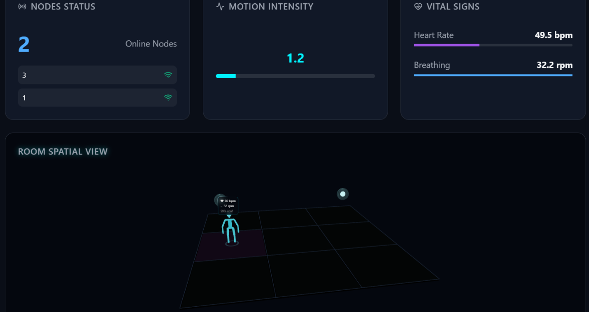

# Presence Detection: 
WiFi CSI Presence & Motion Sensing

Detect **room occupancy, movement, and rough position using only WiFi signals** — no cameras, no microphones, no wearables. Cheap ESP32‑S3 sensors read the WiFi **Channel State Information (CSI)** already flowing through the room, and a Python + React stack turns it into a live dashboard.





> **Honest status.** Presence and motion detection work reliably. Position is **zone‑level** (RSSI‑based, ~1–2 m). Breathing and heart rate are **experimental and not reliable on this hardware** — see [Limitations](#limitations-honest).

---

## What it does

| Capability | Status |
|---|---|
| Presence (occupied vs empty) | Reliable |
| Motion / activity level |  Reliable |
| Rough position of a person | Zone‑level (RSSI trilateration) |
| Breathing rate | Experimental |
| Heart rate | Not reliable on this hardware (weak signal capture on the ESP32s) |

## How it works

```
WiFi router  →  ESP32-S3 node(s)  →  UDP packets  →  Python backend (csi_bridge.py)
                 (reads CSI)          on your LAN       presence + position + motion
                                                              │
                                            WebSocket  ───────┘
                                                              ▼
                                              React dashboard (3-D room view)
```

- **Presence** is decided from **per‑subcarrier, AGC‑normalized CSI amplitude variance** measured against an adaptive per‑node baseline (this is what makes empty‑vs‑occupied separate cleanly).
- **Position** comes from **RSSI** run through a log‑distance path‑loss model and combined across nodes by **trilateration** (circle‑intersection / weighted centroid).
- A deep technical + plain‑language write‑up is in [`docs/`](docs/).

## Repository structure

```
presence-wifi-sensing/
├── backend/          FastAPI signal-processing bridge (the "brain")
│   └── csi_bridge.py   CSI decoding, presence detection, trilateration, WebSocket
├── frontend/         Vite + React + Three.js dashboard (3-D room, status)
│   └── src/hooks/useRuView.js   WebSocket client + Kalman smoothing
├── firmware/         ESP32-S3 CSI node firmware (ESP-IDF), rewritten for multi-node
│   ├── main/           C sources (dual-core CSI capture + DSP pipeline)
│   ├── provision.py    Flash Wi-Fi credentials + target IP into a node
│   └── prebuilt/       Ready-to-flash .bin images
└── docs/             RESEARCH.md + full technical documentation (.docx)
```

## Hardware

| Part | Notes |
|---|---|
| ESP32‑S3 (8 MB flash) | 1 for presence; 2–3 for position. Must be **S3** (dual‑core). |
| 2.4 GHz WiFi router | The transmitter that is sensed (ESP32 CSI is 2.4 GHz only). |
| Host PC | Runs the backend + serves the dashboard. |

## Setup

### 1. Firmware (ESP32‑S3)

Requires **ESP‑IDF v5.4**. From `firmware/`:

```bash
# Build
idf.py build

# Flash (replace COM7 with your port; use /dev/ttyUSB0 on Linux)
idf.py -p COM7 flash

# Provision Wi-Fi + where to send data (your PC's LAN IP)
python provision.py --port COM7 \
  --ssid "YourWiFi" --password "YourPassword" \
  --target-ip 192.168.1.20 --node-id 1
```

Or skip the build and flash the images in `firmware/prebuilt/` directly with `esptool`. For a second node, repeat with `--node-id 2`, etc.

### 2. Backend (Python)

```bash
cd backend
pip install -r requirements.txt
python main.py          # FastAPI + WebSocket on http://localhost:4000
```

Set your node positions (room coordinates) in `NODE_POSITIONS` at the top of `csi_bridge.py`.

### 3. Frontend (React)

```bash
cd frontend
npm install
npm run dev             # dashboard at http://localhost:5173
```

The dev server proxies `/api` and `/ws` to the backend on port 4000.

## Limitations (honest)

- **Vital signs are unreliable on this hardware.** WiFi CSI amplitude can’t cleanly recover the sub‑millimeter chest motion of a heartbeat; the firmware’s breathing/heart output is effectively noise (it reports values even in an empty room). **Breathing** can be made usable with phase‑based processing for a *still* person; **heart rate** realistically needs a 60 GHz mmWave sensor fused in.
- **Position is zone‑level.** RSSI ranging is coarse (~1–2 m) and jittery. Precise tracking would need multi‑antenna CSI phase (angle‑of‑arrival), which the ESP32 doesn’t expose cleanly.
- **Only CSI amplitude is used, not phase.** The ESP32’s phase is corrupted (CFO/STO/SFO). Recovering clean phase is the single biggest upgrade path.
- **Node placement matters a lot.** A person is detected best when their body is between a node and the router. Poorly placed nodes contribute little.
- **Lock nodes to a single WiFi channel.** Channel hopping injects fake “motion” and breaks presence.
- **Start the backend with the room empty** so each node calibrates its quiet baseline correctly.

So why havent I done anything to fix this?

**The truth of the matter is, ESP32s at their core are simply too weak to accurateley determine exact heartrate and breathing rate, the solution to this would be buying expensive equipment dedicated to processing heart rate, breathing rate etc.**

See [`docs/PresenceApp-Technical-Documentation.docx`](docs/) for the full explanation, including the presence algorithm and the multi‑node firmware fix.

## Credits & attribution

The ESP32 firmware in `firmware/` is **derived from the open‑source [RuView](https://github.com/ruvnet/RuView) project (MIT licensed)**. The original firmware contained a node‑ID corruption bug that collapsed all sensors into one, making multi‑node operation impossible; the node‑identity handling was rewritten so multiple nodes can be distinguished — a prerequisite for position estimation. The `backend/` and `frontend/` (PresenceApp) are original work built on top of that firmware.

## License

MIT — see [LICENSE](LICENSE).
