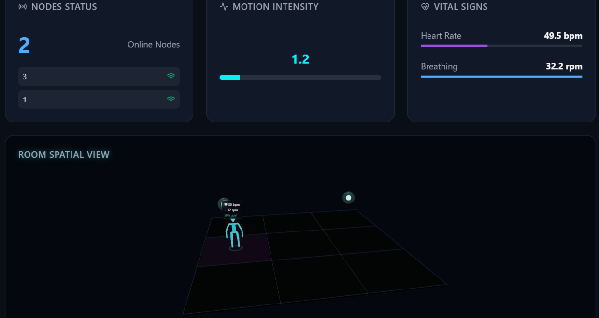

# wifi-csi-presence-sensing

Room presence detection using WiFi. ESP32-S3 boards read the Channel State Information (CSI) from an ordinary 2.4 GHz router, a Python backend works out whether someone is in the room and roughly where, and a React dashboard shows it live. No cameras or wearables.



Presence and motion detection work well. Position is rough (about 1-2 m), so it tells you which part of the room someone is in, not exactly where they're standing. The breathing and heart rate shown on the dashboard aren't reliable on this hardware; see [Limitations](#limitations).

This project doesn't do pose estimation. The figure in the 3D view is a marker drawn at the estimated position, not a tracked body.

## What it can do

| Feature | Status |
|---|---|
| Presence (is anyone in the room) | Works |
| Motion level | Works |
| Position | Rough, zone level |
| Breathing rate | Experimental |
| Heart rate | Not reliable (weak signal capture on the ESP32s) |

## How it works

```
WiFi router -> ESP32-S3 nodes -> UDP -> Python backend -> WebSocket -> React dashboard
```

Each ESP32 listens to the router's WiFi traffic and sends the CSI, the amplitude and phase of each WiFi subcarrier, to the backend over UDP.

For presence, the backend divides each CSI frame by its own average amplitude to cancel out the ESP32's automatic gain control, then measures how much each subcarrier changes over a few seconds. When that rises well above the empty-room level, which is learned separately for each node, the room counts as occupied. In testing this clearly separated someone sitting still from an empty room, which the first approach (averaging all the subcarriers together) couldn't do at all.

For position, each node's signal strength (RSSI) is turned into a rough distance with a path-loss model, and the distances from all the nodes are combined by trilateration.

[docs/RESEARCH.md](docs/RESEARCH.md) covers how this was worked out, including the approaches that didn't work.

## Repository layout

```
wifi-csi-presence-sensing/
├── backend/    FastAPI server: CSI decoding, presence detection, position, WebSocket
├── frontend/   Vite + React + Three.js dashboard
├── firmware/   ESP32 CSI node firmware (RuView v0.7.0) and prebuilt images
└── docs/       Research notes, technical write-up, dashboard screenshot
```

## Hardware

- One or more ESP32-S3 boards with 8 MB of flash (about $9 each). One is enough for presence; position needs two or three. It has to be an S3, because the firmware uses both of its cores.
- A 2.4 GHz WiFi router. The ESP32 only reads CSI on 2.4 GHz.
- A PC on the same network to run the backend and the dashboard.

## Setup

```bash
git clone https://github.com/jonahgigi534-wq/wifi-csi-presence-sensing.git
cd wifi-csi-presence-sensing
```

### 1. Firmware

Flash the prebuilt images in `firmware/prebuilt/` (or build from source), then give each board your WiFi details and your PC's address:

```bash
cd firmware
python provision.py --port COM7 --ssid "YourWiFi" --password "YourPassword" \
  --target-ip 192.168.1.20 --node-id 1
```

Use `--node-id 2`, `3` and so on for the other boards. [firmware/README.md](firmware/README.md) has the flash command and the build steps.

### 2. Backend

```bash
cd backend
pip install -r requirements.txt
python main.py
```

It serves the API and WebSocket on port 4000 and listens for the ESP32s on UDP port 5005. Set where your nodes are in the room (in metres) in `NODE_POSITIONS` at the top of `csi_bridge.py`. Start it with the room empty, because each node learns its empty-room baseline from the first few seconds.

### 3. Dashboard

```bash
cd frontend
npm install
npm run dev
```

Then open http://localhost:5173.

## Limitations

- Breathing and heart rate aren't reliable. WiFi CSI amplitude can't pick up the chest movement from a heartbeat, which is under a millimetre, and the firmware's breathing and heart rate numbers are mostly noise: they still show values with nobody in the room. Breathing might be workable for someone sitting still with phase-based processing. Heart rate needs different hardware, such as a 60 GHz mmWave radar.
- Position is rough. RSSI only gives an approximate distance (about 1-2 m) and it jumps around. A precise position would need CSI phase from boards with several antennas, which the ESP32 doesn't provide.
- Only CSI amplitude is used. The ESP32's phase readings are corrupted by frequency and timing offsets, so the backend ignores them for now.
- Placement matters. A person is easiest to detect when they're between a node and the router, and a badly placed node adds very little.
- Keep the nodes on one channel. If they hop between WiFi channels, the hopping looks like movement and causes false presence.
- The room sometimes flips back to occupied a few seconds after someone leaves. Channel hopping, or something moving near a node such as a fan, are the likely causes.

So why haven't I done anything to fix this? The truth of the matter is, ESP32s at their core are simply too weak to accurately determine exact heart rate and breathing rate. The solution to this would be buying expensive equipment dedicated to processing heart rate, breathing rate, etc.

## Credits

The firmware is [RuView](https://github.com/ruvnet/RuView)'s ESP32 CSI node firmware (MIT), included unchanged. I started on an older RuView build that only let data from one node through. Version 0.7.0 fixes a bug where starting WiFi overwrote each board's node ID, so that's the version used here; [firmware/README.md](firmware/README.md) has the details. The backend and dashboard were written for this project.

## License

MIT. See [LICENSE](LICENSE).
